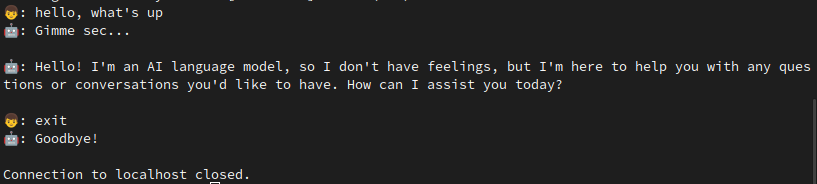

# ChatSSH

Talk with ChatGPT over ssh

## Installation

Simply download binary file from Releases and run it.

By default, ssh server will listen on `0.0.0.0:2222`

## Configuration

`config.yaml` will be created under first run.

**Please set your an OpenAI API key, otherwise it will now work**
